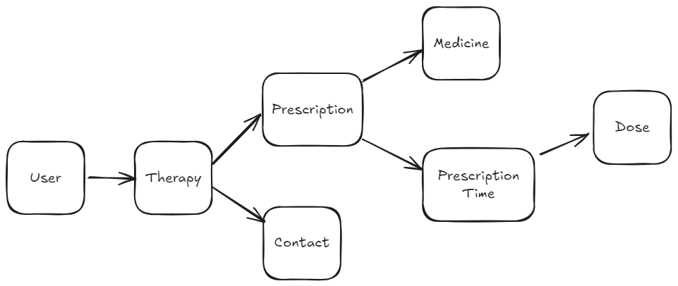

# Medimemo - developer manual

## Install

This is a React applcation scaffolded using Vite, please read the original [README here](./doc/Vite-README.md).

Install: 

`npm install`

Run development:

`npm run dev`

## Glossary

- **User**: app user, logged into MediMemo
- **Therapy**: represents a doctor prescription, contains one or more medicines and medication dosage. It's also linked to a contact (=doctor)
- **Medicine**: represents a drug. It contains also the leaflet
- **Dosage**: represents the association of a Therapy and a Medicine, where starting and ending dates are saved, linked to DosageTimes
- **DosageTime**: represents time of taking a medicine
- **DosageProgress**: represents a medicine taken by user, a new log is saved every time user takes a medicine. It contains info about related datetime, and related DosageTime
- **Contact**: represents a doctor's profile

## Domain model

- User -> has many -> Therapy
- Therapy -> has many -> Dosage- medication represents an association between a therapy and a medicine
- Therapy -> has one -> Contact
- Dosage-> has one -> Medicine
- Dosage -> has many -> DosageTime
- DosageTime -> has one -> DosageProgress

## Flows

### Register (do not implement)

- go to login
- sign up
- login

### First use

This use case describes the first access as a new user

- login
- there aren't medications -> go to therapies
- add a new therapy
- follow the flow "configure therapy"

### Main flow

- login
- go to medications
- check on a DosageProgress

### Configure therapy

- go to therapy page
- create a new therapy
- add a medicine
- add a program for the medicine
- select start and end dates
- add times
- add other medicines
- select a doctor
- add notes
- save

### Add a doctor

- go to contacts page
- click add
- insert doctor information
- save

### View details of a medicine

- go to medications page
- click on the name of a medicine
- read medicine details

### Change your profile

- go to medications page
- click on your account image or name
- edit your personal information

## API

- `POST /login`
- `GET /user`
- `GET /dosage-time`: returns a list of dosage times for current date

TODO