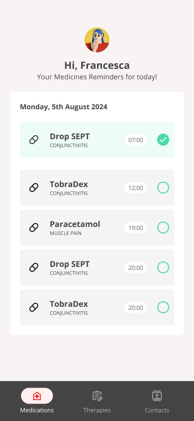

# Medimemo - developer manual

## Install

This is a React applcation scaffolded using Vite, please read the original [README here](./doc/Vite-README.md).

Install: 

`npm install`

Run development:

`npm run dev`

## Visual design reference

Some screenshots of the application:

You can view other screenshots [in the documentation directory on this repository](./doc/screens/).

Visual design and prototype is also available on [Figma](https://www.figma.com/proto/u3QbbGOEuDUcnEZSngo9EG/Oh---MediMemo-UI?node-id=2-2&node-type=canvas&t=GVyTDEfgoRT1MYiI-1&scaling=scale-down&content-scaling=fixed&page-id=0%3A1&starting-point-node-id=2%3A2).

## Glossary

- **User**: app user, logged into MediMemo
- **Therapy**: represents a doctor prescription, contains one or more medicines and medication dosage (Prescription). It's also linked to a Contact (=doctor)
- **Medicine**: represents a drug. It contains also the leaflet
- **Prescription**: represents the association of a Therapy and a Medicine, where starting and ending dates are saved, linked to PrescriptionTimes
- **PrescriptionTime**: represents time of taking a medicine
- **Dose**: represents a reminder, a medicine to be taken by user, and records whether it has been taken. It's related to Prescription and PrescriptionTime
- **Contact**: represents a doctor's profile

## Domain model

- User -> has many -> Therapy
- Therapy -> has many -> Prescription - Prescription represents an association between a Therapy and a Medicine
- Therapy -> has one -> Contact
- Prescription-> has one -> Medicine
- Prescription -> has many -> PrescriptionTime
- PrescriptionTime -> has many -> Dose

## Flows

### Register (do not implement)

- go to login
- sign up
- login

### First use

This use case describes the first access as a new user

- login
- there aren't medications -> go to therapies
- add a new therapy
- follow the flow "configure therapy"

### Main flow

- login
- go to medications
- check on a DosageProgress

### Configure therapy

- go to therapy page
- create a new therapy
- add a medicine
- add a program for the medicine
- select start and end dates
- add times
- add other medicines
- select a doctor
- add notes
- save

### Add a doctor

- go to contacts page
- click add
- insert doctor information
- save

### View details of a medicine

- go to medications page
- click on the name of a medicine
- read medicine details

### Change your profile

- go to medications page
- click on your account image or name
- edit your personal information

## API

### Login and account

- `POST /login`
- `GET /user`
- `PUT /user`: modify user profile

### Reminders

- `GET /doses`: returns the list of today reminders (related to PrescriptionTime)
- `PUT /doses/:id`: allow checking/unchecking a reminder

### Manage therapies

- `GET /therapies`: returns the list of therapies for current user
- `POST /therapies`: allows to save a new therapy
- `GET /therapies/:id`: returns a therapy and its prescriptions
- `PUT /therapies/:id`: allows to change a therapy
- `DELETE /therapies/:id`: removes a therapy
- `GET /therapies/:therapyId/prescriptions`: returns prescriptions associated to a therapy
- `POST /therapies/:therapyId/prescriptions`: saves a new prescription, related to a therapy
- `GET /prescriptions/:id`: returns a prescription and associated prescription times
- `PUT /prescriptions/:id`: changes a prescription
- `DELETE /prescriptions/:id`: removes a prescription
- `GET /prescriptions/:id/prescription-times`: returns prescription times of a prescription
- `POST /prescriptions/:id/prescription-times`: saves a new prescription time, related to a prescription
- `PUT /prescription-times/:id`: changes a prescription time
- `DELETE /prescription-times/:id`: removes a prescription time

### Medicines

- `GET /medicines`: returns a list of medicines
- `GET /medicines/:id`: returns leaflet of a medicine

### Contacts

- `GET /contacts`: returns list of doctors
- `POST /contacts`: adds a new doctor
- `GET /contacts/:id`: returns a doctor
- `PUT /contacts/:id`: modifies doctor's info
- `DELETE /contacts/:id`: removes a doctor
